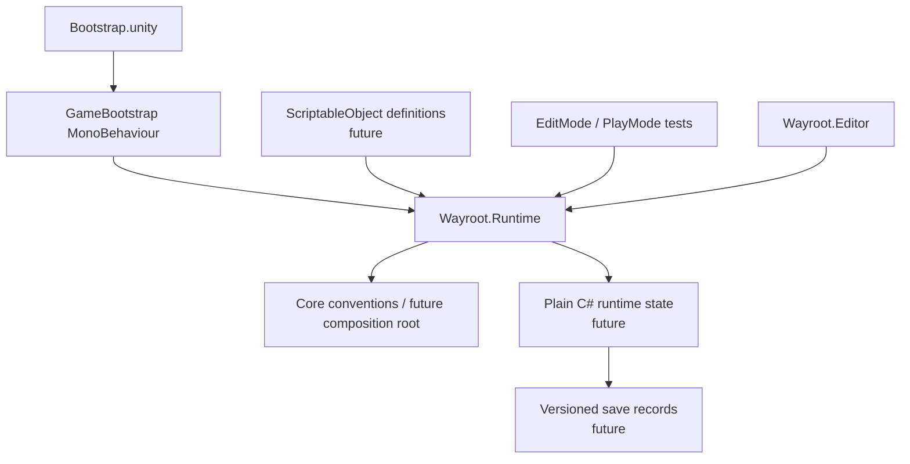

# Architecture

## Principles

Feature-oriented folders, a small bootstrap/composition boundary, data-driven authored definitions, testable domain rules, stable IDs, and no global static player state. Definitions, mutable runtime state, save records, and presentation are separate.

## Phase 0 composition

`Bootstrap.unity` intentionally creates no gameplay systems.

## Layer rules

| Layer | Owns | May depend on | Must not depend on |
|---|---|---|---|
| Definitions | immutable authored ScriptableObjects | Unity serialization | live player/world state |
| Domain/runtime | inventory, stats, commands, seed/delta rules | definitions, pure C# | UI callbacks, scene search |
| Presentation | scene objects, UI, animation/audio | state/events | persistence internals |
| Saving | records, migration, atomic files | state records | MonoBehaviour state |
| Tests | pure rules and critical integration | runtime/editor | production-only services |

## Planned save architecture

Each visible save slot has a versioned plain record: seed, character, inventory/equipment, discovery, region metadata, and deltas. Base regions regenerate from world/region seed + generation version + definitions; deltas then apply. Three visible slots will retain current/previous/older recovery copies. Unity scene objects are never the durable representation.

## Scene flow

Bootstrap → controlled test scene → independently loaded homestead/adventure regions. Wayroot transitions, region loading, quality settings, and save recovery are deferred. Future multiplayer would require authoritative networking, replication, prediction, and conflict resolution, but core code avoids assumptions that make that impossible.
