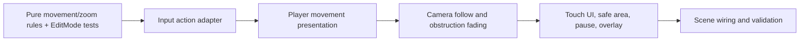

# Phase 1 Implementation Plan — Movement and Camera Prototype

**Status:** Owner approved on 2026-07-19.
**Pinned editor:** Unity 6000.5.4f1.
**Scope boundary:** this is a controlled Sunmeadow-inspired prototype only. It adds no gathering, combat, inventory, procedural generation, saves, networking, or final art.

## Goal

Deliver one small landscape scene that proves the primary movement and presentation loop on desktop and through touch simulation:

- placeholder character movement and facing;
- Input System keyboard/gamepad actions plus a touch virtual joystick;
- fixed-angle, smooth follow camera with pinch zoom and desktop wheel simulation;
- smooth fade for explicit camera obstructions;
- safe-area-aware, left- or right-handed control placement;
- explicit pause behaviour and a development status overlay.

## Implementation order and dependencies

### Task 1 — Domain rules and tests

Create pure, allocation-free movement/facing and zoom-clamp rules before their MonoBehaviour adapters.

**Acceptance criteria**
- Movement magnitude is capped at one.
- Facing remains unchanged for zero input.
- Zoom always stays within configured bounds.
- EditMode tests fail before implementation and pass after it.

**Expected files**
- `Assets/Game/Code/Character/MovementRules.cs`
- `Assets/Game/Code/Camera/CameraZoomRules.cs`
- EditMode tests mirroring those features.

### Task 2 — Device-independent input and player slice

Create Input System actions in a small adapter with keyboard (WASD/arrows), gamepad left stick, Touchscreen and virtual-joystick input. Route UI callbacks into an explicit adapter rather than placing movement rules in buttons. Add a placeholder capsule/collider to the controlled test scene.

**Acceptance criteria**
- Keyboard, gamepad binding, and virtual joystick all submit a normalized movement command.
- The placeholder moves only on the horizontal plane, faces meaningful input, and has no jump action.
- Movement works with a paused game state disabled.

**Expected files**
- `Code/Input/PrototypeInputReader.cs`, `VirtualJoystick.cs`
- `Code/Character/PrototypePlayerController.cs`
- scene/prefab support and tests.

### Task 3 — Camera and obstruction slice

Create a fixed-angle follow camera with configurable smoothing and min/max zoom. Use a non-alloc raycast buffer to find explicit fadeable obstruction renderers between the camera and player, restoring them after they leave the view path.

**Acceptance criteria**
- Camera neither rotates nor clips into the ground in the controlled scene.
- Mouse wheel and two-touch pinch use the same zoom limits.
- Only registered blockers fade; the system reuses its raycast buffer and material-property state.

**Expected files**
- `Code/Camera/TopDownCameraController.cs`, `CameraObstructionFader.cs`, `FadeableObstruction.cs`
- camera tests and controlled-scene objects.

### Task 4 — Mobile presentation and integration

Use uGUI for this prototype (ADR-007). Build the Canvas/EventSystem and safe-area control layout at runtime so the scene remains source-reviewable. Add pause and a development overlay, then document manual validation.

**Acceptance criteria**
- Controls remain inside the safe area in landscape Device Simulator.
- Left/right handed layouts mirror only the controls; UI callbacks stay presentation-only.
- Pause stops player/camera-driven time behaviour and exposes an unpause action.
- Overlay reports movement, zoom, and paused state in development builds.

**Expected files**
- `Code/UI/SafeAreaLayout.cs`, `PauseController.cs`, `DevelopmentOverlay.cs`
- `Code/Core/GameBootstrap.cs`, `Scenes/Bootstrap.unity`
- ADR, roadmap, handoff, and README updates.

## Risks and mitigations

| Risk | Impact | Mitigation |
|---|---|---|
| Runtime-built UI is less convenient to style | Medium | Keep it isolated as disposable prototype presentation; use named serialized/configurable fields in the replacement UI later. |
| Scene YAML hand-authoring is fragile | Medium | Keep the existing scene as a composition root and create simple placeholder objects in bootstrap code; validate through a real Unity import. |
| iPhone build is unavailable on Windows | High for mobile sign-off | Record exact Mac/Xcode handoff and do not claim physical-device verification. |
| Fade transparency differs across URP shaders | Medium | The prototype owns its placeholder material and limits fading to explicit `FadeableObstruction` components. |
| Input package regressions | Medium | Keep the validated Input System 1.19.0 pin and run batch compile/EditMode tests. |

## Final acceptance checkpoint

- [ ] Unity batch compile succeeds with 6000.5.4f1.
- [ ] All EditMode tests pass and result XML is present.
- [ ] A desktop development build is produced if Windows Build Support is installed; otherwise the blocker is recorded.
- [ ] Scene opens and runs in the Unity Editor without new errors.
- [ ] Manual test instructions cover keyboard, controller, joystick, pinch/mouse zoom, obstruction fade, safe area, pause, 60-second profiler sampling, and iPhone handoff.
- [ ] Roadmap, handoff, README, ADRs, and Open Questions reflect the verified outcome.
