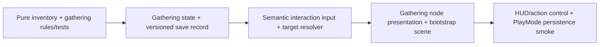

# Phase 2 Implementation Plan — Controlled Gathering Loop

**Status:** Owner approved to proceed on 2026-07-19 after successful desktop play review of Phase 1.
**Pinned editor:** Unity 6000.5.4f1.
**Scope boundary:** a single controlled Sunmeadow test slice for interaction, gathering, inventory, pickup feedback, and one local prototype save. It adds no combat, crafting, equipment, shops, quests, region generation, multi-slot save UX, or final art.

## Goal

Turn the Phase 1 movement prototype into a small complete player loop:

> Move into range of a visible forage plant, tree, or rock → hold the interaction action → receive one resource → see the inventory update → restart and confirm the depleted node remains depleted.

The prototype proves three gathering verbs while sharing a deterministic interaction, inventory, and persistence boundary:

| Node | Input work | Reward | Required progress |
|---|---|---|---:|
| Wildflower | Forage | Wild Petal ×1 | 1 action step |
| Young Tree | Chop | Timber ×1 | 3 action steps |
| Stone Outcrop | Mine | Stone ×1 | 3 action steps |

These are prototype values, not economy balance or final resource names.

## Decisions

- **Interaction selection:** use the nearest active `GatheringNode` within a small radius; player-facing is used only as a tie-breaker. This is stable for keyboard, gamepad, and touch and avoids a camera/screen-ray interaction dependency.
- **Input:** add one semantic `Interact` command to `PrototypeInputReader`: `E`, gamepad south button, and a right-hand uGUI action button. Press/hold is input presentation; gathering logic receives explicit action steps and has no UI dependency.
- **Hold-to-repeat:** a held interaction command produces cadence-limited steps. The player never needs rapid tapping, consistent with the approved touch-control rule.
- **Domain state:** inventory and gathered-node state are plain C# runtime types. Static node definitions are simple serialized component data for this disposable prototype; ScriptableObject definition libraries are deferred until authored content exists.
- **Persistence:** write a versioned JSON record under `Application.persistentDataPath` using an atomic temporary-file replacement. Store only stack counts and stable node IDs; do not serialize scene objects or MonoBehaviour state.
- **Feedback:** use placeholder geometry, colour shifts/deactivation, a compact inventory HUD, and a contextual action label. No final art, animation, sound, or accessibility/menu expansion is included in this phase.

## Dependency graph

## Tasks

### Task 1 — Pure inventory and gathering rules

Create immutable resource identifiers, a bounded inventory model, and gathering-progress rules before Unity adapters.

**Acceptance criteria**
- [ ] Adding a stack respects a max stack of 99 and returns the rejected remainder.
- [ ] Unknown/zero quantities are rejected rather than silently corrupting state.
- [ ] A node rewards exactly once on its final required action step.
- [ ] EditMode tests are red before implementations and green after them.

**Likely files**
- `Assets/Game/Code/Inventory/InventoryState.cs`
- `Assets/Game/Code/Gathering/GatheringRules.cs`
- matching EditMode tests

**Verification:** EditMode test XML records the new tests plus existing regression coverage.

### Task 2 — Versioned prototype save boundary

Create plain record types and a small save service. It owns a current schema version, inventory counts, and depleted stable node IDs; it handles absent/corrupt files by returning an empty state rather than crashing.

**Acceptance criteria**
- [ ] A round-trip preserves inventory counts and depleted IDs.
- [ ] Invalid/unreadable data is rejected safely and results in a new empty runtime state.
- [ ] No scene object, `Transform`, or `MonoBehaviour` occurs in a save record.
- [ ] Unit tests cover current-record conversion and invalid record handling without filesystem dependence.

**Likely files**
- `Assets/Game/Code/Saving/PrototypeSaveRecord.cs`
- `Assets/Game/Code/Saving/PrototypeSaveService.cs`
- `Assets/Game/Tests/EditMode/PrototypeSaveRecordTests.cs`

**Verification:** EditMode suite passes; on-disk smoke is deferred to the PlayMode end-to-end test.

### Checkpoint A

- [ ] New pure rules and save-record tests pass.
- [ ] Batch compile passes.
- [ ] Commit the tested domain/save foundation before presentation work.

### Task 3 — Interaction command and target resolver

Add a device-independent interaction action and a small resolver that selects only active prototype gathering nodes in range. Add a bounded hold cadence; it must stop when paused, out of range, or no target is available.

**Acceptance criteria**
- [ ] Keyboard, gamepad, and action-button callbacks map into the same command state.
- [ ] The resolver does not use scene-wide search every frame and has deterministic nearest-node selection.
- [ ] Holding the action cannot produce gathering steps faster than its configured cadence.

**Likely files**
- `Assets/Game/Code/Input/PrototypeInputReader.cs`
- `Assets/Game/Code/Gathering/InteractionTargetResolver.cs`
- `Assets/Game/Code/Gathering/PrototypeGatheringController.cs`
- associated EditMode tests

**Verification:** compile + EditMode tests; manual keyboard action in the controlled scene.

### Task 4 — Controlled world nodes and feedback

Add three fixed primitive gathering nodes to `GameBootstrap`: wildflower, young tree, and stone outcrop. Configure each with a stable ID, required steps, resource, and color/deactivation feedback. Wire reward events to the inventory and save state.

**Acceptance criteria**
- [ ] The three node types provide the resource/repetition table above.
- [ ] A depleted node cannot be targeted or rewarded again during the session.
- [ ] A saved depleted node is restored depleted at startup.
- [ ] The existing player/camera/pause loop stays functional.

**Likely files**
- `Assets/Game/Code/Gathering/GatheringNode.cs`
- `Assets/Game/Code/Core/GameBootstrap.cs`
- PlayMode composition/persistence test

**Verification:** PlayMode test loads Bootstrap, gathers a test node, reloads, and asserts it remains depleted.

### Task 5 — Mobile-first action and inventory HUD

Add a safe-area-aware right-side `GATHER` hold button and small inventory/status readout to the existing disposable uGUI bootstrap. Keep HUD callbacks presentation-only.

**Acceptance criteria**
- [ ] `GATHER` sends no direct inventory/gathering mutation; it only sets the semantic interaction command.
- [ ] HUD updates after each reward and shows the selected/current target prompt.
- [ ] Pause disables gathering input; safe-area layout keeps action controls accessible in landscape.

**Likely files**
- `Assets/Game/Code/UI/VirtualActionButton.cs`
- `Assets/Game/Code/UI/GatheringHud.cs`
- `Assets/Game/Code/UI/SafeAreaLayout.cs`
- `Assets/Game/Code/Core/GameBootstrap.cs`

**Verification:** PlayMode smoke plus manual desktop/Device Simulator test.

### Checkpoint B — Phase 2 acceptance

- [ ] Unity batch compile succeeds with 6000.5.4f1.
- [ ] All EditMode tests pass and results XML is parsed.
- [ ] Relevant PlayMode tests pass and runtime logs contain no new exceptions.
- [ ] A Windows development build is produced and launched briefly.
- [ ] Manual guide covers movement, action hold, all three nodes, inventory, persistence restart, pause, safe area, and reset instructions.
- [ ] Commit/push verified; roadmap, handoff, README, ADRs, and Open Questions are current.

## Risks and mitigations

| Risk | Impact | Mitigation |
|---|---|---|
| Input cadence differs across keyboard, gamepad, and touch | Medium | One semantic command and a single controller-owned cadence gate. |
| Prototype save leaks across manual test sessions | Medium | Document a reset command/button and keep the save filename isolated to Phase 2. |
| Stable IDs change during scene/boot refactors | High | Explicit literal IDs in the controlled bootstrap, never object instance IDs. |
| Scope turns into crafting/economy | High | Cap at three resources/three nodes, no recipes or costs. |
| Runtime-built UI becomes hard to replace | Medium | Keep presentation adapters thin; domain state never references UI types. |

## Deferred questions

- Final resource names, art, gather durations, audio, animation, tool equipment, recipes, and economy tuning.
- Visible save-slot/menu/reset UX beyond a development-only reset path.
- Physical iPhone touch/performance evidence remains required before mobile polish approval.
